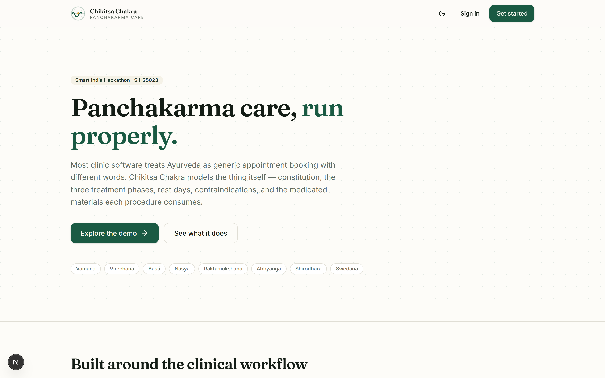
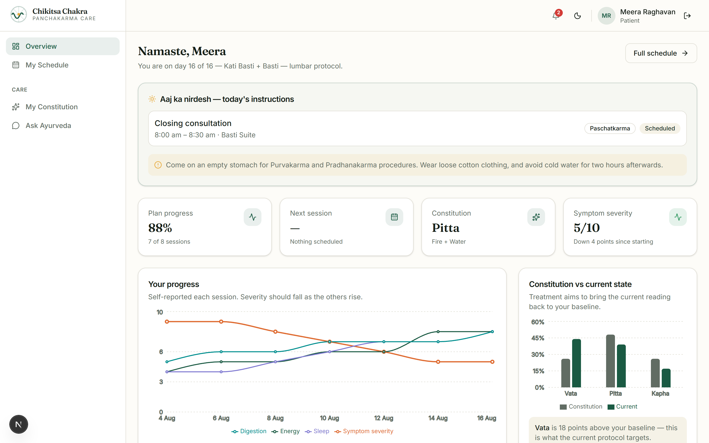
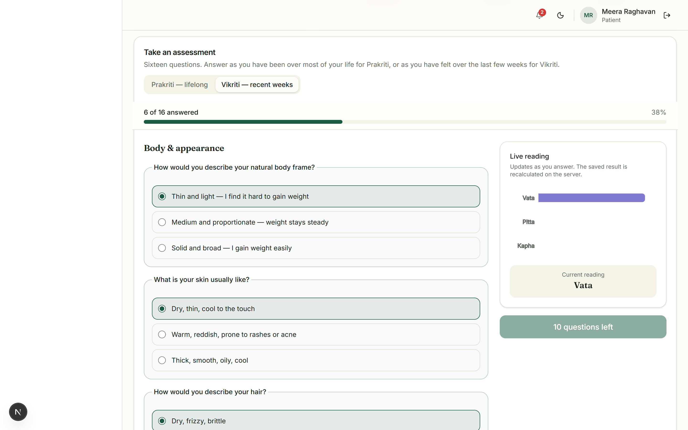
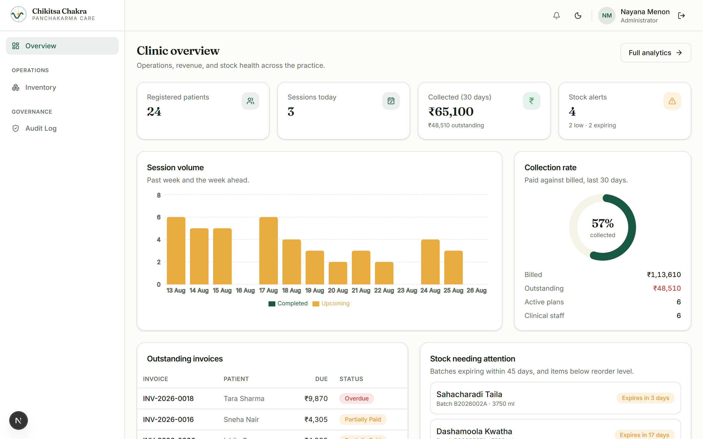
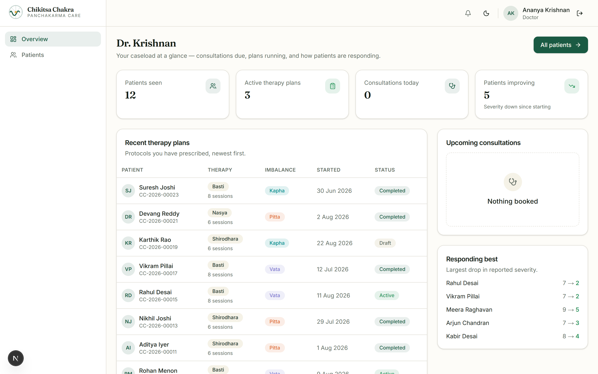
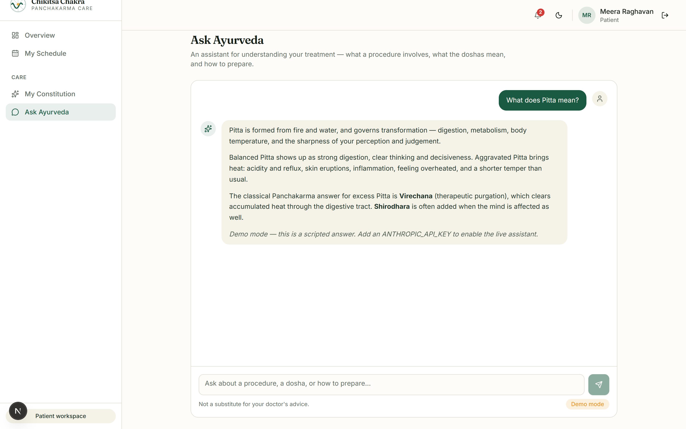
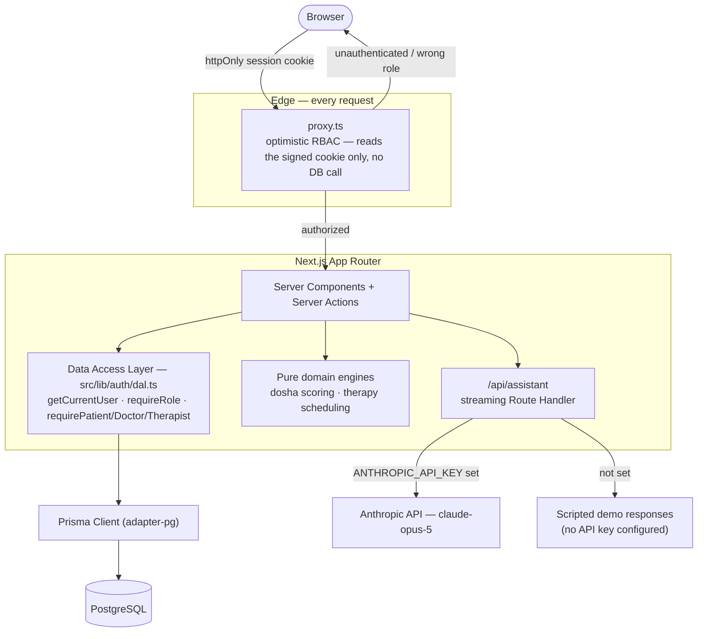
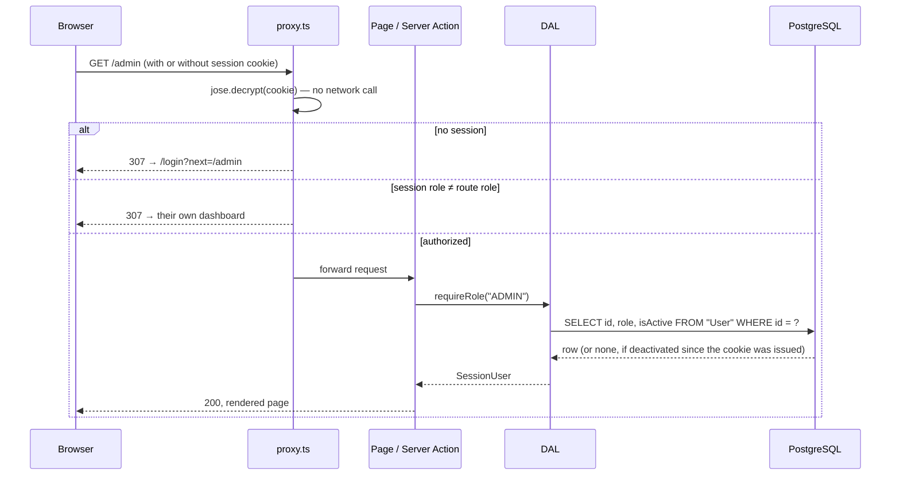
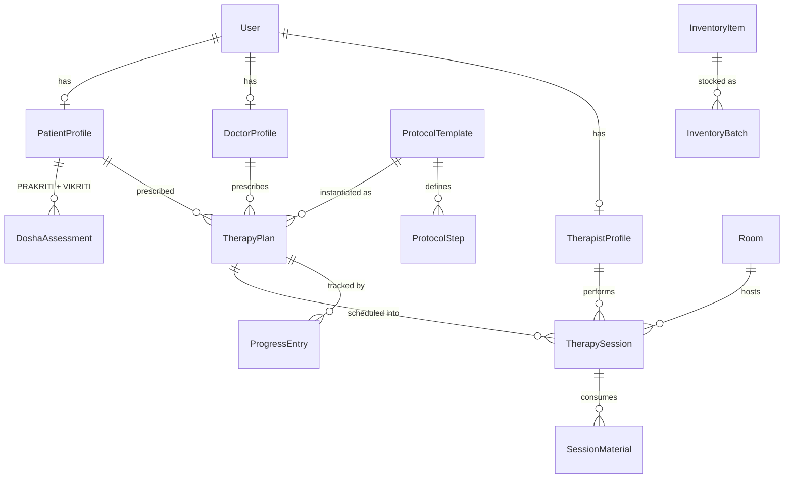

<div align="center">


# Chikitsa Chakra

**Panchakarma patient management and therapy scheduling for Ayurvedic clinics.**

Smart India Hackathon 2025 · Problem Statement **SIH25023** · Team Chikitsa Chakra (Team ID 22)

[](https://github.com/nayana3333/chikitsa-chakra/actions/workflows/ci.yml)


[Quick start](#quick-start) · [Screenshots](#screenshots) · [Architecture](#architecture) · [The engines](#the-engines) · [Security](#security-model) · [Tests](#tests)

</div>

<!--
  DEMO VIDEO — see docs/screenshots/README.md for how to record a 60–90s
  walkthrough and get a hosted URL from GitHub's attachment CDN, then replace
  this comment with:
  https://github.com/user-attachments/assets/<your-asset-id>
-->

---

## What this is

Most clinic-management projects treat Ayurveda as generic appointment booking with different words on the buttons. This one models the actual thing: a constitution assessment that distinguishes what a patient *is* from what a patient *currently is*, a scheduling engine that understands Panchakarma's mandatory three-phase structure, and a permission model where a stolen session cookie doesn't hand over the clinic.

Four roles share one record. A doctor prescribes a protocol, a scheduling engine lays it across the calendar with real resource conflicts resolved, a therapist executes and logs each session, and the patient watches their own progress against their own baseline.

| Role | What they see |
|---|---|
| **Patient** | Today's instructions, upcoming sessions, dosha profile plotted against baseline, a progress chart, diet guidance, and a scoped AI assistant |
| **Doctor** | Patient queue, prescribed therapy plans, each patient's dominant imbalance, and who is responding best to treatment |
| **Therapist** | The day's roster as a timeline, per-session vitals capture, and their certified procedures |
| **Admin** | Session volume, revenue collection rate, outstanding invoices, stock and batch-expiry alerts, and an append-only audit log |

---

## Screenshots

<!-- Run the ten-minute capture guide in docs/screenshots/README.md, then these render automatically. -->

<table>
<tr>
<td width="50%"><br /><sub align="center">Landing page</sub></td>
<td width="50%"><br /><sub>Patient dashboard — progress chart, dosha comparison, today's plan</sub></td>
</tr>
<tr>
<td width="50%"><br /><sub>Live Prakriti/Vikriti assessment — the scoring engine updating in real time</sub></td>
<td width="50%"><br /><sub>Admin analytics — session volume and collection rate</sub></td>
</tr>
<tr>
<td width="50%"><br /><sub>Doctor dashboard — caseload and treatment response</sub></td>
<td width="50%"><br /><sub>Streaming Ayurveda assistant</sub></td>
</tr>
</table>

More in [`docs/screenshots/`](docs/screenshots/), including the therapist roster, inventory alerts, and dark mode.

---

## Quick start

```bash
git clone https://github.com/nayana3333/chikitsa-chakra.git
cd chikitsa-chakra
npm install
```

Start the bundled local Postgres server:

```bash
npm run db:start
```

Copy `.env.example` to `.env`, then run `npx prisma dev ls` and paste the **TCP** connection string it prints (`postgres://...`, not the `prisma+postgres://` proxy URL — Prisma 7's driver adapter needs a standard connection string) into `DATABASE_URL`. Generate a session secret:

```bash
node -e "console.log(require('crypto').randomBytes(32).toString('hex'))"
```

Paste that into `SESSION_SECRET`. `ANTHROPIC_API_KEY` is optional — see [AI assistant](#ai-assistant-with-a-real-fallback) below.

```bash
npm run db:migrate
npm run db:seed
npm run dev
```

Open **http://localhost:3000**.

### Demo accounts

All four use the password `Chikitsa@2026`:

| Role | Email |
|---|---|
| Patient | `patient@chikitsa.dev` |
| Doctor | `doctor@chikitsa.dev` |
| Therapist | `therapist@chikitsa.dev` |
| Admin | `admin@chikitsa.dev` |

The seed is deterministic and idempotent — 24 patients with dosha assessments, 24 therapy plans, **159 therapy sessions placed by the real scheduling engine** (not fixtures), 103 progress entries plotted on the patient charts, inventory batches deliberately set to expire soon, and a mix of paid and outstanding invoices. Every dashboard has real, internally-consistent data on first run.

---

## Architecture



**Why authorization sits in the DAL and not the proxy.** `proxy.ts` (Next 16's renamed middleware) runs on every request including prefetches, so it only ever reads the signed cookie — never the database. The database-backed check — is this account still active, does this role still match — happens in the Data Access Layer, next to the data it protects, and is memoized per render with React's `cache()` so ten components calling `getCurrentUser()` cost one query. Next.js layouts don't re-render across sibling-route navigations, so a check placed there would go stale; the DAL is called from every page and Server Action individually instead.



A deactivated account loses access on its very next request, independent of how long the JWT has left to live — the token only ever carries an id and a role, so revocation is a database write, not a token-blacklist problem.

### Domain model (simplified)

The full schema is 29 models and 17 enums — [`prisma/schema.prisma`](prisma/schema.prisma) is the source of truth. This is the subset that carries the clinical story:



---

## The engines

The clinical logic lives in dependency-free TypeScript modules — no Prisma import, no React import, nothing but plain data in and plain data out. That is what makes 38 tests possible without a database, and it's why a real scoring bug (below) surfaced in a unit test during development instead of in front of a judge.

### Constitution scoring — [`src/lib/ayurveda/dosha.ts`](src/lib/ayurveda/dosha.ts)

A 16-question weighted questionnaire ([`questions.ts`](src/lib/ayurveda/questions.ts)) scores Vata, Pitta and Kapha. Questions carry different weights on purpose — classical assessment doesn't treat every trait equally. Stable physical traits (frame, skin, hair) are strong, lifelong evidence of constitution; mood and appetite fluctuate day to day and are weaker signal for *that* reading, though they're exactly what you want when reading current imbalance instead.

It produces two separate numbers, and the gap between them is the entire clinical point:

- **Prakriti** — the constitution a patient was born with. Fixed for life.
- **Vikriti** — where they are right now. Shifts with season, diet, stress, illness.

```ts
// src/lib/ayurveda/dosha.ts
export function compareToBaseline(
  prakriti: DoshaScores,
  vikriti: DoshaScores,
): { deviations: DoshaDeviation[]; imbalanceScore: number; primaryImbalance: DoshaDeviation | null } {
  const deviations: DoshaDeviation[] = DOSHAS.map((dosha) => {
    const delta = vikriti[dosha] - prakriti[dosha];
    return {
      dosha,
      prakriti: prakriti[dosha],
      vikriti: vikriti[dosha],
      delta,
      status:
        delta > IMBALANCE_THRESHOLD ? "AGGRAVATED" :
        delta < -IMBALANCE_THRESHOLD ? "DEPLETED" : "BALANCED",
    };
  });
  // ...
}
```

This measures *drift from the patient's own baseline*, not an absolute threshold — a Pitta-dominant person sitting at 55% Pitta is simply being themselves, while a Kapha-dominant person at 55% Pitta has moved a long way and that's what a doctor treats. It's what drives the comparison chart on the patient dashboard.

Percentages use the largest-remainder method rather than naive rounding, so three shares always sum to exactly 100 instead of landing on 99 or 101 next to a chart:

```ts
// src/lib/ayurveda/dosha.ts
function toPercentages(scores: DoshaScores, totalWeight: number): DoshaScores {
  if (totalWeight === 0) return { VATA: 0, PITTA: 0, KAPHA: 0 };
  const exact = DOSHAS.map((d) => ({ dosha: d, value: (scores[d] / totalWeight) * 100 }));
  const floored = exact.map((e) => ({ ...e, floor: Math.floor(e.value) }));
  let remaining = 100 - floored.reduce((sum, e) => sum + e.floor, 0);
  const byRemainder = [...floored].sort((a, b) => (b.value - b.floor) - (a.value - a.floor));
  // distribute the leftover points to whichever doshas were rounded down hardest
  // ...
}
```

### Therapy scheduling — [`src/lib/scheduling/engine.ts`](src/lib/scheduling/engine.ts)

Takes a protocol template and produces a dated, resource-allocated plan against real therapist and room availability. It knows Panchakarma runs **Purvakarma → Pradhanakarma → Paschatkarma** and sorts sessions by day and then by phase; it honours prescribed rest days, which consume no room or therapist; it matches each therapy to the room type it actually needs (Basti needs the Basti suite, Swedana needs the steam chamber — pairing them wrong isn't a scheduling nicety, it's a session nobody can actually run); and it never double-books a therapist or a room, including against every other session already placed in the same plan.

```ts
// src/lib/scheduling/engine.ts
export function schedulePlan(params: {
  sessions: PlannedSession[];
  therapyType: TherapyType;
  therapists: TherapistInput[];
  rooms: RoomInput[];
  existingBookings: ExistingBooking[];
  options?: SchedulingOptions;
}): ScheduleResult {
  const opts = { ...DEFAULTS, ...params.options };
  // Working copy so placements within this plan block each other too.
  const bookings: ExistingBooking[] = [...params.existingBookings];
  const scheduled: ScheduledSession[] = [];
  const unscheduled: UnscheduledSession[] = [];
  // ...
}
```

Placement is earliest-fit, deliberately not an optimiser: clinics genuinely prefer morning slots because most procedures are done on an empty stomach, and a greedy pass produces a calendar a receptionist can predict and manually override — an optimal-but-opaque schedule is worse in a clinic than a good-enough, legible one.

When a session can't be placed, the engine returns a typed reason instead of leaving a silent gap in the calendar — `NO_THERAPIST_WITH_EXPERTISE`, `NO_ROOM_AVAILABLE`, `CLINIC_CLOSED`, `NO_SLOT_IN_WORKING_HOURS` — each with a human-readable detail string a receptionist can act on.

```ts
// src/lib/scheduling/engine.ts
export function checkContraindications(
  therapy: TherapyType,
  ctx: ContraindicationContext,
): ContraindicationFinding[] {
  const findings: ContraindicationFinding[] = [];
  if (ctx.isPregnant) {
    if (therapy === "VAMANA" || therapy === "VIRECHANA" ||
        therapy === "RAKTAMOKSHANA" || therapy === "BASTI") {
      findings.push({ severity: "ABSOLUTE", message: `${therapy} is contraindicated in pregnancy.` });
    }
  }
  // ...
}
```

Classical contraindications — Vamana in cardiac disease, purgation therapies in pregnancy, Swedana's burn risk in diabetes — are flagged for the prescribing doctor to see and acknowledge. **The function never blocks a prescription.** Encoding "the software decides" into a clinical system is the wrong default; encoding "the software makes sure nothing was overlooked, and records that it was checked" is the right one. `TherapyPlan.contraindicationsChecked` persists that acknowledgment.

The seed script runs this exact engine to place all 159 sessions in the demo data, so it's exercised end to end on every fresh clone — not only inside `vitest`.

### Stock allocation — [`src/lib/inventory/consume.ts`](src/lib/inventory/consume.ts)

When a therapist marks a session complete, the materials that session's protocol step calls for need to come from somewhere real — a batch, with an expiry date. This third engine decides which batch: earliest-expiry-first, spilling into the next batch once one runs out, and returning a partial allocation plus an explicit shortfall instead of throwing when total stock genuinely isn't enough. A clinic shouldn't lose the ability to chart that a session happened because the stockroom is short — the shortfall becomes a signal on the admin inventory page, not a blocked save.

```ts
// src/lib/inventory/consume.ts
export function allocateConsumption(
  requestedQuantity: number,
  batches: BatchStock[],
): AllocationResult {
  const ordered = [...batches]
    .filter((b) => b.quantity > 0)
    .sort((a, b) => a.expiryDate.getTime() - b.expiryDate.getTime());
  // walk oldest-expiring batches first, spilling into the next once one is exhausted
  // ...
}
```

The Server Action that calls it — [`completeTherapySession`](src/app/actions/sessions.ts) — runs the whole thing inside one Prisma transaction: matching the session back to its protocol step, allocating and decrementing stock across however many batches that takes, writing a `StockMovement` audit row per batch touched, and updating the session's status and vitals. Charting a session and drawing down what it consumed are one clinical event; the transaction makes sure they can't partially fail and leave the record and the stockroom disagreeing.

---

## AI assistant, with a real fallback

A streaming assistant on the patient dashboard, built on the Anthropic API (`claude-opus-5`, adaptive thinking, a cached system prompt).

**The scope boundary matters more than the capability.** The system prompt explicitly allows explaining doshas, procedures, and how to prepare for a session, and explicitly forbids diagnosing anything or recommending, adding, or changing any therapy, medicine, or dose — that decision belongs to the treating doctor, always. Those rules live in the prompt because the model is what has to honour them; they are not enforced by, and cannot be worked around through, the UI.

```ts
// src/lib/ai/client.ts
export const PATIENT_ASSISTANT_SYSTEM = `You are the Ayurveda guide inside Chikitsa Chakra...

What you never do:
- Diagnose a condition, or suggest what a symptom means for this specific patient.
- Recommend, change, add, or stop any therapy, medicine, dose, or protocol.
  That is the treating doctor's decision, always.
- Contradict or second-guess instructions the patient's doctor or therapist has given.
...`;
```

**It degrades honestly instead of breaking.** Without `ANTHROPIC_API_KEY`, `/api/assistant` streams pre-written answers through the *identical* Route Handler and the *identical* client-side rendering path — same chunked response, same UI, same persisted chat history — and the badge in the composer says **Demo mode** rather than pretending. A portfolio project that 500s because an environment variable is unset is a worse first impression than one that tells you plainly what it's missing.

---

## Security model

The reference implementation this project's problem statement is commonly solved with stores `localStorage.setItem('authToken', 'dummy-auth')` and decides access from a `userType` string sitting in the same browser storage a content script can read. That is not a security model — it is a UI state variable wearing a security model's name. This project's approach:

- **Sessions are signed JWTs in an httpOnly cookie** ([`jose`](https://github.com/panva/jose), HS256, `sameSite: lax`). Unreachable from `document.cookie`, so a successful XSS still can't lift the session.
- **The token carries an id and a role, and nothing else.** Everything richer — name, email, clinical data — is read from the database on demand, so a stolen cookie leaks no patient data by itself, and a deactivated account loses access on its next request rather than whenever its token happens to expire.
- **Authorization lives in one Data Access Layer**, not scattered across pages or duplicated in layouts — see [Architecture](#architecture) above.
- **Passwords are bcrypt at cost 12.** Login always compares the submitted password against a hash — a real one on a match, a dummy constant-shaped one when no account matches — so response timing can't be used to enumerate which emails are registered. Every failure mode (wrong email, wrong password, deactivated account) returns one identical message.
- **Server Actions and Route Handlers re-verify independently.** They are public HTTP endpoints regardless of whether a button for them is rendered; hiding the button is not access control, and every mutation checks the caller's role itself.
- **Public self-registration creates patient accounts only.** Doctor, therapist, and admin accounts are provisioned by an administrator — a public form that could mint a "doctor" role would be the entire access-control model undone by one dropdown.
- **An append-only audit log** records logins, registrations, assessment submissions, and clinical-record changes, each tied to the acting user.

The [smoke test](#tests) exercises three of these directly against a running server: a patient's session cookie cannot reach `/admin`, an anonymous request is redirected to login rather than served, and a cookie signed with the wrong secret is rejected outright.

---

## Tests

```bash
npm test
```

45 unit tests over three engines: dosha weighting and largest-remainder rounding, dual-dosha and tridoshic classification, baseline-drift status; scheduling's overlap detection, phase ordering, rest-day handling, room-type matching, therapist availability and time-off, double-booking prevention across an entire plan, turnaround buffers, load-spreading across therapists, and contraindication flags; and stock allocation's earliest-expiry-first consumption, multi-batch spillover, and graceful partial allocation when stock is short.

One of them caught a real bug during development. With zero questions answered, every dosha score ties at exactly zero — which is *also* what a perfectly balanced tridoshic constitution looks like on paper. The scoring function fell through that ambiguity into the "two doshas are close" branch and confidently reported a **Vata-Pitta** constitution derived from no evidence at all. The fix distinguishes "no data" from "balanced data" explicitly, and now returns `"Not assessed"` when nothing was submitted:

```ts
// src/lib/ayurveda/dosha.test.ts
it("does not claim a constitution when nothing was answered", () => {
  const result = scoreAssessment({});
  expect(result.constitutionName).toBe("Not assessed");
  expect(result.secondary).toBeNull();
});
```

```bash
npm run dev              # terminal 1
node scripts/smoke.mjs   # terminal 2
```

[`scripts/smoke.mjs`](scripts/smoke.mjs) mints session cookies exactly the way the app does (`jose`, same secret, same claim shape), then asserts every dashboard and sub-page renders with real seeded data, that the streaming assistant actually returns tokens, and that all three access-control paths above hold — against a real running server, not mocks.

```bash
npm run typecheck && npm run lint && npm run build
```

All three, plus the test suite, run on every push via [GitHub Actions](.github/workflows/ci.yml).

---

## Tech stack

| | Version | Why this and not the obvious alternative |
|---|---|---|
| [Next.js](https://nextjs.org) | 16.3, App Router | Server Components remove an entire API layer for read paths; Server Actions do the same for writes. Both dashboards and mutations ship as one codebase. |
| [TypeScript](https://www.typescriptlang.org) | 5.9, `strict` | End-to-end types from the database through to JSX, with zero `any` in the domain engines. |
| [Prisma](https://www.prisma.io) | 7.9, `prisma-client` generator + `@prisma/adapter-pg` | Prisma 7 requires an explicit driver adapter and generates into `src/generated/prisma` rather than `node_modules` — see [Prisma 7 notes](#notes-on-the-framework-versions). |
| PostgreSQL | via Prisma's bundled dev server locally | Real enums, `Decimal`, and `Json` columns — the domain has all three. |
| [Tailwind CSS](https://tailwindcss.com) | v4, CSS-first `@theme` | An oklch-based palette that stays perceptually consistent between light and dark mode, not just inverted. |
| [Radix UI](https://www.radix-ui.com) + [CVA](https://cva.style) | — | Accessible primitives (`Dialog`, `Tabs`, `Progress`, …) with hand-written styling — no black-box component library to work around. |
| [jose](https://github.com/panva/jose) + [bcryptjs](https://github.com/dcodeIO/bcrypt.js) | — | Session signing and password hashing — see [Security model](#security-model). |
| [Zod](https://zod.dev) | 4 | Validates every Server Action and Route Handler input — never trusts client-submitted data. |
| [Recharts](https://recharts.org) | — | The only client-rendered code in the UI layer; isolated to [`src/components/charts.tsx`](src/components/charts.tsx) so every other component can stay a Server Component. |
| [Vitest](https://vitest.dev) | — | Runs the 38 pure-function tests with no database and no DOM. |
| [Anthropic SDK](https://github.com/anthropics/anthropic-sdk-typescript) | `claude-opus-5` | Powers the assistant — see [AI assistant](#ai-assistant-with-a-real-fallback). |

### Notes on the framework versions

Next.js 16 and Prisma 7 are both current majors with real breaking changes from what most training data and tutorials assume, and this project follows the current conventions rather than the ones that are easier to find written up:

- Middleware is **`proxy.ts`**, exporting `proxy()` — not `middleware.ts`. The `edge` runtime isn't supported there.
- `cookies()`, `headers()`, `params`, and `searchParams` are **async only**; the Next 15 synchronous compatibility shim is gone.
- Route types come from `next typegen` — `PageProps<'/route'>`, `LayoutProps<'/route'>`. A layout inside a route group (`(auth)/layout.tsx`) has no URL segment of its own, so it takes plain React props instead.
- `forbidden()` needs `experimental.authInterrupts` set in `next.config.ts`; without it, an authenticated-but-unauthorised user has no way to get a real 403 instead of being redirected to login as if signed out.
- Prisma 7 **requires a driver adapter** for SQL databases (`@prisma/adapter-pg` + `pg` here), generates the client into `src/generated/prisma` — so imports read `@/generated/prisma/client`, never `@prisma/client` directly — and moves the datasource URL out of `schema.prisma` into `prisma.config.ts`.
- The Postgres connection pool is deliberately capped **below** the dev server's own connection limit. Several dashboards fan multiple queries out with `Promise.all`; an uncapped pool opens one connection per query and overshoots that limit, which the server answers by silently closing the socket — surfacing as an opaque `P1017` mid-render with no useful stack trace.

---

## Project structure

```
prisma/
  schema.prisma           29 models, 17 enums — the domain
  seed.ts                 deterministic clinic generator (runs the real scheduling engine)
src/
  app/
    (auth)/                login, register
    patient/ doctor/ therapist/ admin/     one route tree per role
    notifications/          shared across every role
    api/assistant/           streaming AI Route Handler
    actions/                 Server Actions — auth, assessment, notifications
    icon.tsx apple-icon.tsx opengraph-image.tsx    generated brand assets, no binary files
  components/
    ui/                      Button, Card, Input, Badge, Dialog, Table, …
    shell/                   role-aware sidebar + topbar
    charts.tsx               the only client-rendered chart code
  lib/
    ayurveda/                dosha scoring engine + questionnaire        ← tested
    scheduling/               therapy scheduling engine                  ← tested
    auth/                    session signing, Data Access Layer
    ai/                      Anthropic client + demo-mode fallback
  proxy.ts                   optimistic route protection (Next 16's renamed middleware)
scripts/
  smoke.mjs                  end-to-end auth + render verification against a live server
.github/workflows/ci.yml     lint, typecheck, test, build — on every push
```

---

## Deploying

The app is a standard Next.js deployment — no custom server, no special build step. Point `DATABASE_URL` at any managed Postgres (Neon, Supabase, RDS); the same variable works unchanged because local development already speaks plain TCP Postgres, not a proprietary local-only protocol. Set a fresh `SESSION_SECRET` per environment, run `npx prisma migrate deploy` once against the target database, and optionally set `ANTHROPIC_API_KEY` to move the assistant from demo mode to live. Setting `NEXT_PUBLIC_SITE_URL` resolves the generated Open Graph image to an absolute URL once a domain exists.

---

## What's not built

In the interest of the README matching the code exactly: a therapist completing a session now allocates and deducts the materials that session's protocol step calls for — earliest-expiry batch first, recorded as a `StockMovement`, all inside one transaction with the status update — but two related behaviours are still not wired up: an invoice-generation UI (invoices currently only come from the seed) and actual reminder delivery over SMS or email (notifications are in-app only). There's no video-consultation feature and no medicine-ordering integration, both mentioned as future direction in the team's proposal deck.

---

## Engineering decisions worth discussing

The short version of the reasoning behind the choices above, for anyone reading the code cold:

1. **Clinical logic is pure functions.** Neither engine imports Prisma or React. That's what makes 38 tests possible with no database in the loop, and it's what let the tridoshic-from-zero-data bug surface in a unit test during development instead of during a demo.
2. **Authorization sits next to the data, not in the UI.** Next.js layouts don't re-render across sibling-route navigation; the Data Access Layer does, on every single call, and every Server Action re-checks independently because it is a public endpoint whether or not a page links to it.
3. **Failed scheduling returns a reason, not a gap.** `UnscheduledSession` carries a typed reason and a human-readable detail — a receptionist looking at an unscheduled session gets told *why*, not left to guess.
4. **Contraindications advise; they don't decide.** A clinical system that silently blocks a prescription has made a judgment call that belongs to the doctor. Recording that the check happened is the software's actual job here.
5. **The AI degrades instead of failing.** Same Route Handler, same streaming path, same UI — scripted content and an honest "Demo mode" badge when there's no key, rather than an error page.
6. **The seed uses the real engine.** Demo data is generated by calling `schedulePlan()`, not by hand-writing plausible-looking fixtures — so if the scheduler ever breaks, the seed breaks with it, and the two can't silently drift apart.

---

## License

[MIT](LICENSE)
